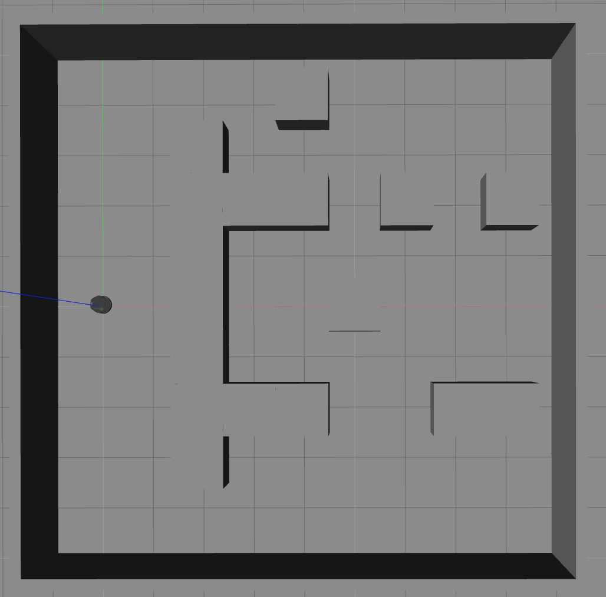
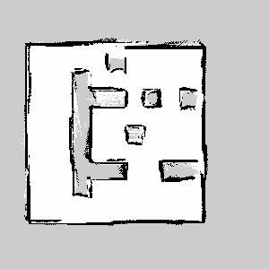
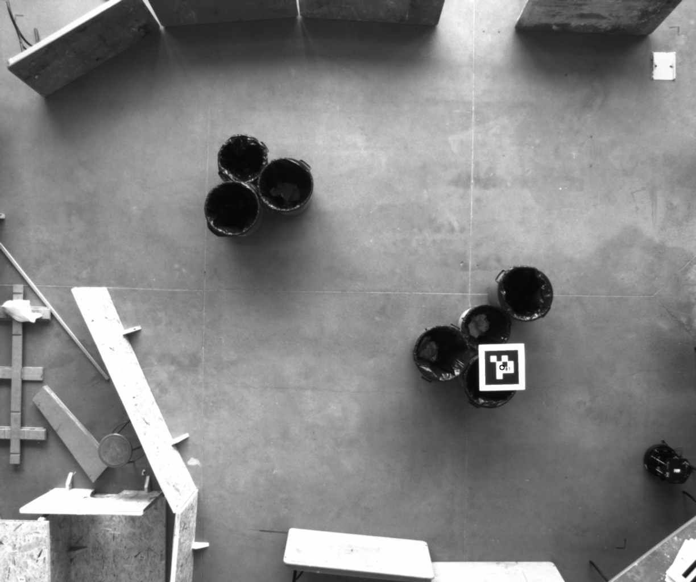
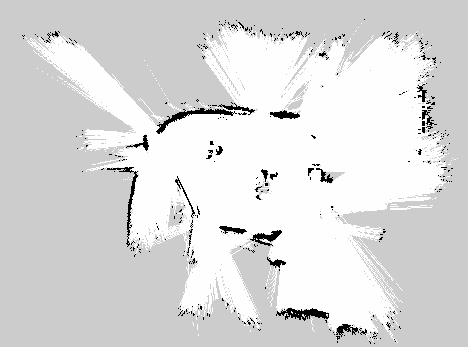
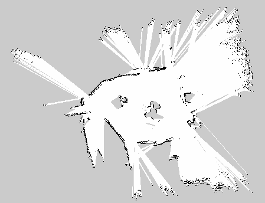

# turtlebot_slam

## Mapping using Rosbags

Use the `launch/rosbag_mapping.launch` launch file (parameters documented below).

```
roslaunch turtlebot_slam rosbag_mapping.launch bagfile:=<path to bagfile> playback_factor:=<factor>  pause:=<pause> mapping_backend:=<backend>
```

Use `rqt_reconfigure` to adjust mapping parameters

```
rosrun rqt_reconfigure rqt_reconfigure
```

### Parameters

- `bagfile`: Absolute path to bagfile containing all relevant ros messages. `Default: ''`
- `mapping_backend`: The mapping backend to use for creating the maps. Choose one of `ours` or `gmapping`. `Default: ours`
- `pause`: Start with bagfile playing paused (press spacebar to start playing data). If false, data starts playing immediately. `Default: true`
- `playback_factor`: Rate at which the bagfile should be played. `Default: 1.0 (real-time)`

## Results

We evaluate the quality of maps generated using our *naive* mapping algorithm
## Simulated Environment

Gazebo environment:





## Real Environment 

Birds-eye view of the environment



Results of mapping:

**Ours:**



**GMapping:**



We can see that our map is definitely inferior to that of GMapping, but still gets the job done!
